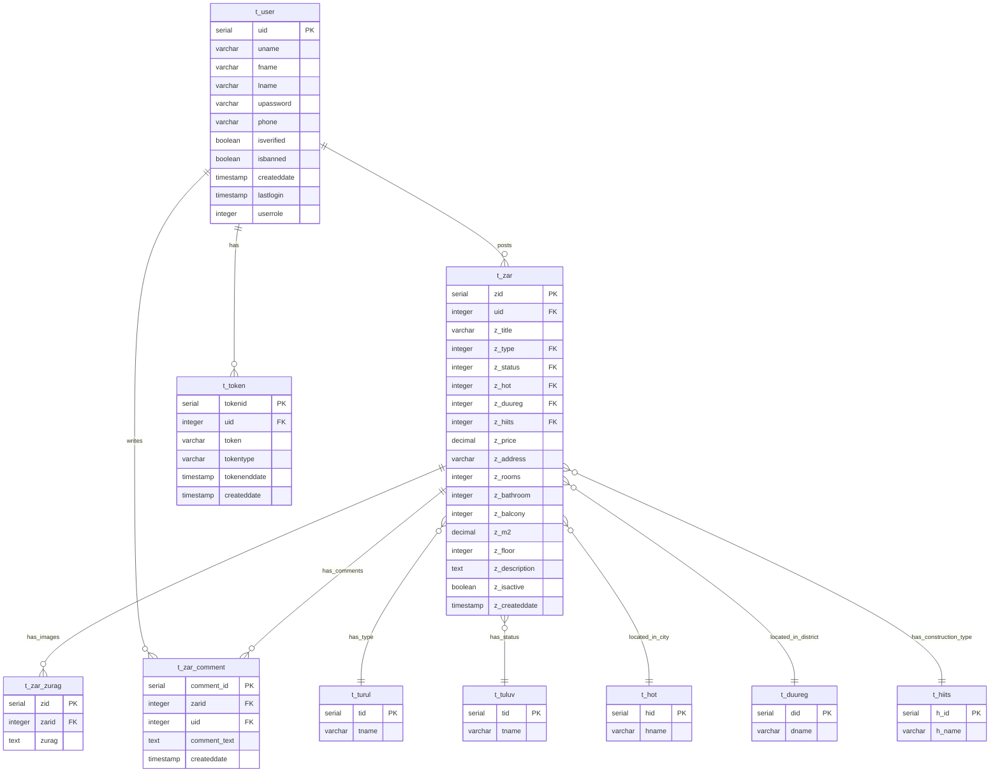

# Database ERD - Visual Diagram

## Entity Relationship Diagram



## ASCII Art ERD

```
┌─────────────────────────────────────────────────────────────────┐
│                         DATABASE SCHEMA                          │
└─────────────────────────────────────────────────────────────────┘

┌──────────────────────┐
│      t_user          │
├──────────────────────┤
│ uid (PK)             │◄─────┐
│ uname                │      │
│ fname                │      │
│ lname                │      │
│ upassword            │      │
│ phone                │      │
│ isverified           │      │
│ isbanned             │      │
│ createddate          │      │
│ lastlogin            │      │
│ userrole             │      │
└──────────────────────┘      │
         │                     │
         │ 1                   │
         │                     │
         │ N                   │
         │                     │
         ▼                     │
┌──────────────────────┐       │
│      t_zar           │       │
├──────────────────────┤       │
│ zid (PK)             │       │
│ uid (FK) ────────────┼───────┘
│ z_title              │
│ z_type (FK) ────────┐│
│ z_status (FK) ─────┐││
│ z_hot (FK) ────────┐│││
│ z_duureg (FK) ─────┐││││
│ z_hiits (FK) ──────┐│││││
│ z_price             ││││││
│ z_address           ││││││
│ z_rooms             ││││││
│ z_bathroom          ││││││
│ z_balcony           ││││││
│ z_m2                ││││││
│ z_floor             ││││││
│ z_description       ││││││
│ z_isactive          ││││││
│ z_createddate       ││││││
└──────────────────────┘│││││
         │               │││││
         │ 1             │││││
         │               │││││
         │ N             │││││
         │               │││││
         ▼               │││││
┌──────────────────────┐│││││
│   t_zar_zurag        ││││││
├──────────────────────┤│││││
│ zid (PK)             ││││││
│ zarid (FK) ──────────┘│││││
│ zurag                ││││││
└──────────────────────┘│││││
                        │││││
┌──────────────────────┐│││││
│  t_zar_comment       ││││││
├──────────────────────┤│││││
│ comment_id (PK)      ││││││
│ zarid (FK) ──────────┘│││││
│ uid (FK) ─────────────┘││││
│ comment_text          │││││
│ createddate           │││││
└──────────────────────┘││││
                        ││││
┌──────────────────────┐││││
│      t_token         ││││
├──────────────────────┤│││
│ tokenid (PK)         ││││
│ uid (FK) ────────────┘│││
│ token                 │││
│ tokentype             │││
│ tokenenddate          │││
│ createddate           │││
└──────────────────────┘│││
                        │││
┌──────────────────────┐│││
│      t_turul         │││
├──────────────────────┤││
│ tid (PK) ────────────┘││
│ tname                 ││
└──────────────────────┘│
                        │
┌──────────────────────┐│
│      t_tuluv         ││
├──────────────────────┤│
│ tid (PK) ────────────┘│
│ tname                 │
└──────────────────────┘

┌──────────────────────┐
│      t_hot           │
├──────────────────────┤
│ hid (PK) ───────────┘
│ hname
└──────────────────────┘

┌──────────────────────┐
│      t_duureg        │
├──────────────────────┤
│ did (PK) ────────────┘
│ dname
└──────────────────────┘

┌──────────────────────┐
│      t_hiits         │
├──────────────────────┤
│ h_id (PK) ───────────┘
│ h_name
└──────────────────────┘
```

## Table Relationships

### Primary Relationships

1. **User → Properties (1:N)**
   - One user can post multiple properties
   - Foreign Key: `t_zar.uid` → `t_user.uid`

2. **User → Tokens (1:N)**
   - One user can have multiple authentication tokens
   - Foreign Key: `t_token.uid` → `t_user.uid`

3. **User → Comments (1:N)**
   - One user can write multiple comments
   - Foreign Key: `t_zar_comment.uid` → `t_user.uid`

4. **Property → Images (1:N)**
   - One property can have multiple images
   - Foreign Key: `t_zar_zurag.zarid` → `t_zar.zid`

5. **Property → Comments (1:N)**
   - One property can have multiple comments
   - Foreign Key: `t_zar_comment.zarid` → `t_zar.zid`

6. **Property → Type (N:1)**
   - Many properties belong to one type
   - Foreign Key: `t_zar.z_type` → `t_turul.tid`

7. **Property → Status (N:1)**
   - Many properties belong to one status
   - Foreign Key: `t_zar.z_status` → `t_tuluv.tid`

8. **Property → City (N:1)**
   - Many properties belong to one city
   - Foreign Key: `t_zar.z_hot` → `t_hot.hid`

9. **Property → District (N:1)**
   - Many properties belong to one district
   - Foreign Key: `t_zar.z_duureg` → `t_duureg.did`

10. **Property → Construction Type (N:1)**
    - Many properties belong to one construction type
    - Foreign Key: `t_zar.z_hiits` → `t_hiits.h_id`

## Foreign Key Constraints

All foreign keys use `ON DELETE CASCADE` to maintain referential integrity:
- When a user is deleted, their properties, tokens, and comments are deleted
- When a property is deleted, its images and comments are deleted

## Indexes

Performance indexes:
- `idx_zar_comment_zarid` on `t_zar_comment(zarid)`
- `idx_zar_comment_uid` on `t_zar_comment(uid)`
- `idx_zar_comment_createddate` on `t_zar_comment(createddate DESC)`

